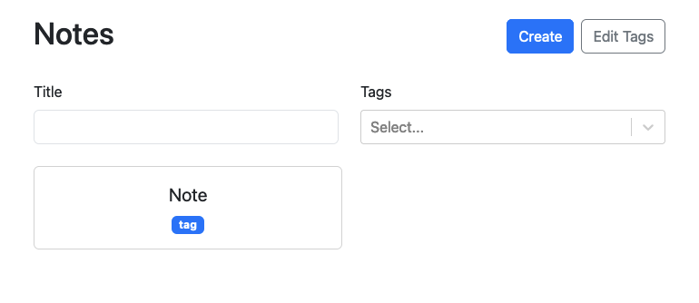
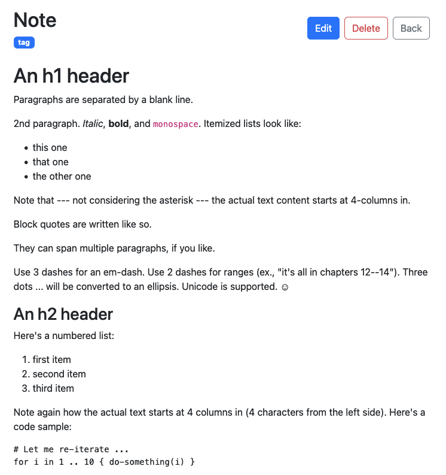

# Markdown Note App

The app is using local storage to store notes and tags.
Create notes, edit and delete them. Attach tags to it. Later you can update or remove those tags.



Technologies used:

- React
- Typescript
- Vite
- React-Router
- Bootstrap

**Installation**

Install the project dependencies using npm:

```bash
npm install
```

**Running the Project**

```bash
npm run dev
```
